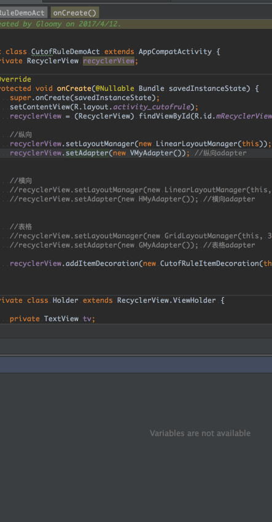

#### 简介

一个RecyclerView分割线

目前支持:LinearLayoutManager/GridLayoutManager

看demo

#### demo图



#### 用法说明

调用RecyclerView的addItemDecoration(new CutofRuleItemDecoration(this));

分割线可以通过重写主题样式的来制定

```xml
<item name="android:listDivider">@drawable/line</item>
```

也可以通过CutofRuleItemDecoration的另一个构造方法传入!


#### 具体demo

具体使用方法也可以看demo

看：app中的CutofRuleDemoAct 这个即可